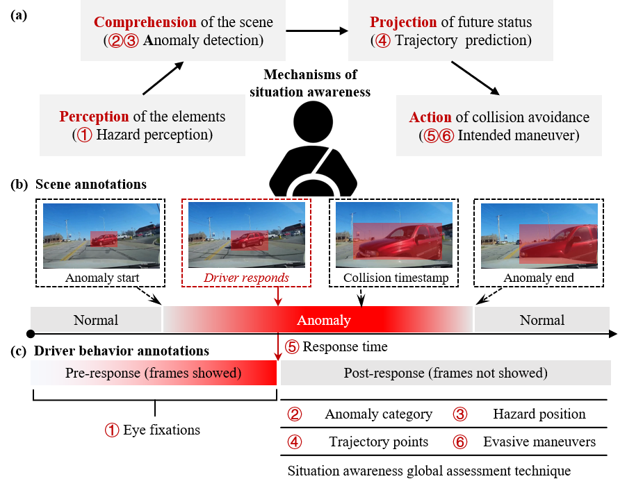

# PSAD-dataset

## Introduction

Personalized situation awareness of drivers (PSAD) dataset is the first public driver behavior dataset integrating situation awareness framework. 

 (a) four sub-stages of the situation awareness cognitive process: **perception, comprehension, projection, and action**; (b) **scene annotations**; (c) **driver behavior annotations**.

## Download link

All data of PSAD can be downloaded from:

Stimuli videos (Baidu disk): [https://pan.baidu.com/s/1MN1-xKBGXleo0AlNYP_5Sg](https://pan.baidu.com/s/1MN1-xKBGXleo0AlNYP_5Sg) , password: PSAD

Scene annotations (Google disk): [https://drive.google.com/file/d/1fUTxLj-XqQJexKzlz6iJWYRIiw0awlPS/view?usp=sharing](https://drive.google.com/file/d/1fUTxLj-XqQJexKzlz6iJWYRIiw0awlPS/view?usp=sharing)

Driver behavior annotations (Google disk): [https://drive.google.com/drive/folders/1WDOAExB4NncgAl2-JLIWMlIymtmn-oXB?usp=sharing](https://drive.google.com/drive/folders/1WDOAExB4NncgAl2-JLIWMlIymtmn-oXB?usp=sharing)

## Data content

**Stimuli videos** consisted of 2724 real-world accidental videos with 1280×720 resolution and 30 fps, screened from [DoTA](https://github.com/MoonBlvd/Detection-of-Traffic-Anomaly) dataset. 

**Scene annotations** consisting of anomaly start, collision timestamp, anomaly end, accident type  and object_labels for each stimuli video.

- Object_labels comprise object track ID and category, bounding box. 
- Note: frame_id in object_labels were labeled at 10 fps,  the corrected frame id is equal 3 times original id. 

**Driver behavior annotations** were collected from six experienced drivers (index: from 100 to 105), which consisting of eye fixations, anomaly category, hazard position, trajectory points, response time, and evasive maneuver. 

===========================================================================

Citation:
If you find our dataset is useful, please cite below paper.

	@InProceedings{Gan_2021_ITSC,
	author = {Shun Gan, Quan Li, Qingfan Wang, WenTao Chen, Detong Qin and Bingbing Nie},
	title = {Constructing personalized situation awareness dataset for hazard perception, comprehension, projection, and action of drivers},
	booktitle = {The IEEE Conference on Intelligent Transportation Systems,
	year = {2018}
	}
	
===========================================================================

## Data visualization
WE illustrated the data visualization of some cases from PSAD 

**p8q77QzOdUs_001954**  

**HNRS3w5zep8_000543**  

**4K_6s1n6BpU_000957**  

